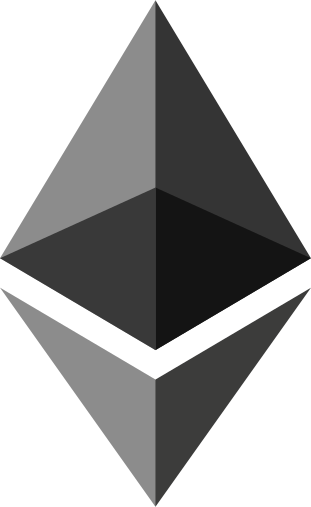

welcome to my GitHub Page. I am a senior frontend developer, I have 7+ years of experience in web development

## My favorite tools and technologies ⚙️

> Tools and technologies that I have worked with and am interested in

<table>
  <tr>
    <td align="center"  width="96">
        
       HTML5
    </td>
    <td align="center" width="96">
        
       CSS3
    </td>
    <td align="center" width="96">
        
       JavaScript
    </td>
    <td align="center" width="96">
        
       TypeScript
    </td>
    <td align="center" width="96">
        
       Sass
    </td>
    <td align="center" width="96">
        
       React
    </td>
    <td align="center" width="96">
        
       Angular
    </td>
    <td align="center" width="96">
        
       Vue
    </td>
    <td align="center" width="96">
        
       Svelte
    </td>
  </tr>
  <tr>
    <td align="center" width="96">
        
       Next
    </td>
    <td align="center" width="96">
        
       Nuxt
    </td>
    <td align="center" width="96">
        
       Gatsby
    </td>
    <td align="center" width="96">
        
       Styled components
    </td>
    <td align="center" width="96">
        
       Emotion CSS
    </td>
    <td align="center" width="96">
        
       Material UI
    </td>
    <td align="center"  width="96">
        
       Bootstrap
    </td>
    <td align="center" width="96">
        
       Tailwind CSS
    </td>
        <td align="center" width="96">
        
       jQuery
    </td>
  </tr>
  <tr>
    <td align="center" width="96">
        
       Express.js
    </td>
    <td align="center" width="96">
        
       WebSocket
    </td>
    <td align="center" width="96">
        
       Three.js
    </td>
    <td align="center" width="96">
        
       D3.js
    </td>
    <td align="center" width="96">
        
       Web3.js
    </td>
    <td align="center" width="96">
        
       Ethers.js
    </td>
    <td align="center" width="96">
        
       Hardhat
    </td>
    <td align="center" width="96">
        
       Truffle
    </td>
    <td align="center" width="96">
        
       Figma
    </td>
  </tr>
   <tr>
    <td align="center" width="96">
        
       REST API
    </td>
    <td align="center" width="96">
        
       GraphQL
    </td>
    <td align="center" width="96">
        
       Apollo Client
    </td>
    <td align="center" width="96">
        
       Postman
    </td>
    <td align="center" width="96">
        
       Redis
    </td>
    <td align="center" width="96">
        
       Elastic Search
    </td>
    <td align="center" width="96">
        
       PHP
    </td>
    <td align="center"  width="96">
        
       Laravel
    </td>
    <td align="center" width="96">
        
       Node.js
    </td>
  </tr>
  <tr>
    <td align="center" width="96">
        
       Git
    </td>
    <td align="center" width="96">
        
       GitHub
    </td>
    <td align="center" width="96">
        
       GitLab
    </td>
    <td align="center" width="96">
        
       BitBucket
    </td>
    <td align="center" width="96">
        
       Vercel
    </td>
    <td align="center" width="96">
        
       Netlify
    </td>
    <td align="center" width="96">
        
       Heroku
    </td>
    <td align="center" width="96">
        
       Docker
    </td>
    <td align="center" width="96">
        
       Kubernetes
    </td>
  </tr>
  <tr>
    <td align="center" width="96">
        
       Jest
    </td>
    <td align="center" width="96">
        
       Cypress
    </td>
    <td align="center" width="96">
        
       Selenium
    </td>
    <td align="center" width="96">
        
       Jenkins
    </td>
    <td align="center" width="96">
        
       GitHub Actions
    </td>
    <td align="center" width="96">
        
       AWS
    </td>
    <td align="center"  width="96">
        
       Azure
    </td>
    <td align="center" width="96">
        
       GCP
    </td>
        <td align="center" width="96">
        
       Firebase
    </td>
  </tr>
  <tr>
    <td align="center" width="96">
        
       UI/UX
    </td>
    <td align="center" width="96">
        
       Responsive
    </td>
    <td align="center" width="96">
        
       SEO
    </td>
    <td align="center" width="96">
        
       CMS
    </td>
    <td align="center" width="96">
        
       Sanity
    </td>
    <td align="center" width="96">
        
       Payment Integration
    </td>
  </tr>
</table>

    

<table>
  <tr>
    <td></td>
    <td></td>
   </tr>
</table>

<h3 align="left"> Connect with me: </h3>

    
    

    

⭐️ From Viotemis(https://github.com/Viotemis)
